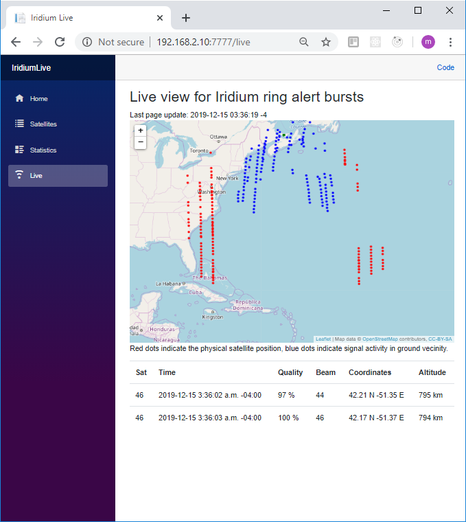

# IridiumLive

*Welcome to IridiumLive!*

IridiumLive is a [Blazor](https://docs.microsoft.com/en-us/aspnet/core/blazor/?view=aspnetcore-3.1) server application which allows for the real-time vizualization of the iridium satellites as they pass above your location. 

It is another tool which allows for the visualization of live data coming from gr-iridium. Will not work without it. 

You install the application in your local network, and use the browser to interact with it.

#### Setup

At this time the following ports have been hard coded:
```
 7777: IridiumLive server port,
15007: udp port for receiving data from gr-iridium and iridium-toolkit.
```
The data will be provided by your personal install of gr-iridium and iridium-toolkit (see [gr-iridium](https://github.com/muccc/gr-iridium) and [iridium-toolkit](https://github.com/muccc/iridium-toolkit)).
1. On the same machine as gr-iridium download and extract the python udp transmitter [udp-for-il.py](udp-for-il.py). Please install in the same folder as gr-iridium.
2. Depending of your intended OS target, download and extract the appropriate IridiumLive archive. There is no installation needed, simply extract in a folder of its own. You can extract either on the same machine or to a different one.
3. In the udp-for-il.py script, the **server_address** **(192.168.2.10)** denotes the machine where IridiumLive is installed. Modify it accordingly. This address is also where you will open your browser to later on:
```python
...
import socket

ap = ("192.168.2.10", 15007)
sk = socket.socket(family=socket.AF_INET, type=socket.SOCK_DGRAM)
def sendOverUdp(line):
...
```
4. Instantiate the iridium receiver and pipe through decoder, filter and udp transmitter adapting the following command line:
```
user@computer:~/gr-iridium$ iridium-extractor --offline --multi-frame examples/hackrf.conf | ~/iridium-toolkit/iridium-parser.py -p /dev/stdin /dev/stdout | grep "sat:" | python udp-for-il.py
```
5. Only continue to next step if you see udp lines being transmitted:
```python
191
1576397118 | i:  68/s | i_avg:  19/s | q:    0 | q_max:    7 | o: 106/s | ok:  63% | ok:  43/s | ok_avg:  51% | ok:      32064 | ok_avg:   9/s | d: 0
1576397119 | i:  67/s | i_avg:  19/s | q:    0 | q_max:    6 | o: 103/s | ok:  64% | ok:  43/s | ok_avg:  51% | ok:      32108 | ok_avg:   9/s | d: 0
1576397120 | i:  58/s | i_avg:  19/s | q:    0 | q_max:    5 | o:  91/s | ok:  57% | ok:  33/s | ok_avg:  51% | ok:      32142 | ok_avg:   9/s | d: 0
1576397121 | i:  69/s | i_avg:  19/s | q:    0 | q_max:    4 | o: 115/s | ok:  61% | ok:  42/s | ok_avg:  51% | ok:      32185 | ok_avg:   9/s | d: 0
169
173
191
169 <- the length of one blob sent over UDP
173
191
169
```
6. Run IridiumLive. 
7. Open any browser at http://**server_address**:7777 and enjoy!

#### Credits

* [gr-iridium](https://github.com/muccc/gr-iridium)
* [iridium-toolkit](https://github.com/muccc/iridium-toolkit)
* [blazor workshop](https://github.com/dotnet-presentations/blazor-workshop)
* [spa with blazor server and ef](https://www.c-sharpcorner.com/article/create-a-single-page-app-with-blazor-server-and-entity-framework-core-3-0/)

#### Disclaimer

This is my first .NET Core web app. Blazor on top of it. Be gentle!

<p align="center">
  
</p>
